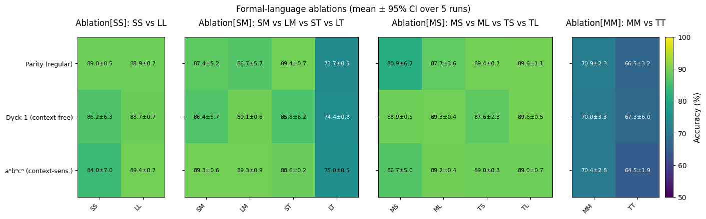

---

# xLSTM Hybrid Benchmarks

This project benchmarks **hybrid sequence models** made from combinations of xLSTM, LSTM, and Transformer blocks on two tasks:

* **Multi-Query Associative Recall (MQAR)**
* **Chomsky-Hierarchy Formal Languages (CH)**



The benchmark code lives in the **`experiments/`** directory, and all experiments are launched through **`main_thesis.ipynb`**.

---

## Setup

```bash
conda env create -f environment.yml
conda activate xlstm
```

---

## Running Experiments

1. Open **`main_thesis.ipynb`** in Jupyter/Lab.
2. Set the device:

   ```python
   import torch
   DEVICE_STR = "cuda" if torch.cuda.is_available() else "cpu"
   ```
3. Import and run benchmarks from the `experiments/` directory, for example:

```python
# Formal Languages
from experiments.ch_formal_benchmark import run_formal_benchmark
results = run_formal_benchmark(device_str=DEVICE_STR, benchmark_type="sm_combinations")
```

Results (plots + JSON summaries) are saved in the working directory or under `./results/` depending on the benchmark.

---
