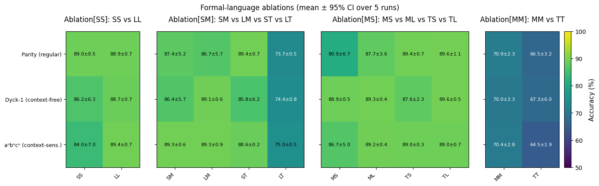
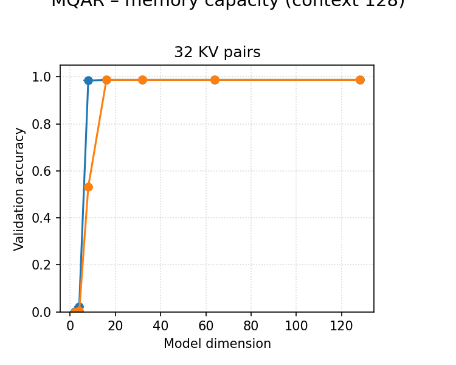

# xLSTM Hybrid Benchmarks

An experiment suite for comparing two-block combinations of matrix-LSTM,
scalar-LSTM, conventional LSTM, and Transformer blocks on memory-intensive
sequence tasks.

The repository contains benchmark code, notebooks, committed JSON results, and
the figures produced from those results. It covers Multi-Query Associative Recall
(MQAR) and Chomsky-hierarchy formal-language tasks.

## What was tested

- Capacity sweeps over embedding width for complete two-block configurations
- Architecture ablations that exchange one recurrent or attention block at a time
- MQAR at explicit sequence length and key-value count settings
- Formal-language experiments with repeated runs where the committed results
  support uncertainty estimates

The benchmark implementations are in experiments/, shared model and training
code is in utils/, and main_thesis.ipynb is the experiment control surface.

## One result, in context

For the committed MQAR sweep at N=128 and KV=32, General-MM and General-TT are
both evaluated over the full width range 2, 4, 8, 16, 32, 64, and 128. At width
8 the recorded validation scores differ sharply (0.984 for MM and 0.532 for TT);
by width 16 both are approximately 0.987.

These values describe the recorded task and training configuration. Capacity
points are reported as single runs, while repeated formal-language ablations are
summarized separately with their mean and 95% confidence interval.

The compact JSON behind the comparison is
results/mm_vs_tt/summary_N128_train20000_val4000.json. Raw run files remain
alongside it so the plotted range can be audited.

## Reproduce

The committed environment targets Python 3.12, PyTorch 2.5.1, CUDA 12.1, and
xlstm 1.0.8.

    conda env create -f environment.yml
    conda activate xlstm2
    cp .env.example .env

Adjust CUDA_HOME and TORCH_CUDA_ARCH_LIST for the local CUDA toolchain, then open
main_thesis.ipynb. Individual entry points are also available in experiments/:

    from experiments.ch_formal_benchmark import run_formal_benchmark

    results = run_formal_benchmark(
        device_str="cuda",
        benchmark_type="sm_combinations",
    )

Generated JSON and figures are written under results/ or the notebook working
directory, depending on the benchmark.

## Evaluation notes

- MQAR and formal-language tasks provide controlled tests of sequence memory and
  architecture behavior.
- Capacity sweeps report one run per point; repeated formal-language experiments
  report mean and 95% confidence intervals.
- Runtime and kernel performance depend on the CUDA, compiler, and GPU
  configuration.
- The modules under `experiments/` are the primary entry points for reproduction.

Explore the results interactively in the
[portfolio case study](https://medoali.at/work/xlstm-sequence-benchmarks).
