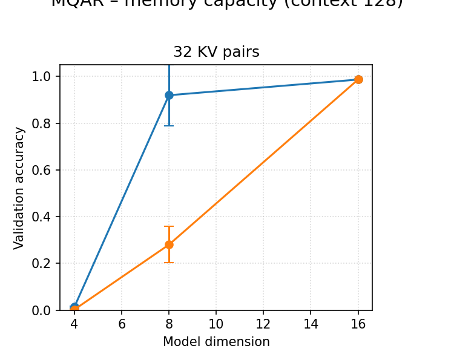

# Attention-Recurrent Hybrids

**An ablation study of xLSTM blocks on associative recall and formal
languages.**

This repository contains the implementation, experiment notebooks, recorded
results, and figures for a capacity-matched comparison of xLSTM, standard LSTM,
and Transformer blocks in two-block sequence models.

## Central research question

> Under matched model capacity, data, and training, does replacing the xLSTM
> matrix-memory block (mLSTM) with a Transformer block and/or replacing the
> xLSTM scalar-memory block (sLSTM) with a standard LSTM yield a measurable
> performance advantage on MQAR and Chomsky-hierarchy formal-language tasks?

## Ablation design

Every model is represented by a two-letter block string:

- `S` — sLSTM
- `M` — mLSTM
- `L` — standard LSTM
- `T` — Transformer

For each base xLSTM stack, the study replaces `S` with `L`, `M` with `T`, or
both while holding the model interface and experimental conditions constant.

| Base stack | Matched comparison set |
| --- | --- |
| `SS` | `SS`, `LL` |
| `SM` | `SM`, `LM`, `ST`, `LT` |
| `MS` | `MS`, `TS`, `ML`, `TL` |
| `MM` | `MM`, `TT` |

The unified wrapper keeps the token embeddings, output heads, hidden width,
block depth, sequence length, number of heads, normalization, and dropout policy
fixed across matched substitutions. Each model-benchmark configuration is
evaluated with five independent seeds. Results are reported as the mean with a
two-sided 95% confidence interval.

## Benchmarks

### Multi-Query Associative Recall

MQAR measures content-based retrieval. A sequence introduces key-value pairs and
later repeats the keys among distractor tokens. Accuracy is measured only at the
query positions, where the model must predict the associated value.

The final ablation uses:

- context length `N = 128`
- `D = 32` key-value pairs
- vocabulary size `8192`
- model widths `d = 4, 8, 16`
- validation accuracy at query positions

### Formal languages

The formal-language suite tests structured, rule-based sequence processing at
three levels of the Chomsky hierarchy:

- Parity — regular
- Dyck-1 — context-free
- `aⁿbⁿcⁿ` — context-sensitive

All three datasets are class-balanced. Models classify at the final sequence
position after processing the full sequence. The final experiments use sequence
length 64, hidden and embedding dimension 256, four heads where applicable,
10,000 training examples, and 2,000 validation examples.

## Main findings

- At the informative MQAR width `d = 8`, retaining an mLSTM block is the main
  determinant of performance. In the direct `MM` versus `TT` comparison, `MM`
  reaches `92.0 ± 8.8%` validation accuracy and `TT` reaches `28.0 ± 5.2%`.
- Replacing `M` with `T` in the matched `SM` and `MS` groups produces a
  statistically significant drop at `d = 8`. Replacing `S` with `L` does not
  produce a statistically significant change in the same setting.
- MQAR is at a floor at `d = 4` and near its ceiling at `d = 16`; the thesis
  therefore bases its component-level conclusion on the non-saturated `d = 8`
  regime.
- Across Parity, Dyck-1, and `aⁿbⁿcⁿ`, stacks with at least one scalar-recurrent
  block (`S` or `L`) outperform the fully matrix-memory `MM` stack in these
  experiments.
- Within the scalar-recurrent regime, most `S ↔ L` and isolated `M ↔ T`
  substitutions remain within the reported uncertainty. No reliable ordering
  advantage is observed between `SM` and `MS` once a scalar pathway is present.

These conclusions apply to the thesis's small, two-block, capacity-matched
setting and synthetic benchmarks.




## Repository structure

- `main_thesis.ipynb` — experiment orchestration and recorded notebook outputs
- `experiments/mqar_benchmark.py` — MQAR generation, training, evaluation, and
  capacity sweeps
- `experiments/ch_formal_benchmark.py` — Parity, Dyck-1, and `aⁿbⁿcⁿ`
  experiments
- `utils/model_architectures.py` — the shared hybrid-model wrapper and block
  implementations
- `results/xlstm_ablation/` — repeated MQAR runs, summaries, and figures
- `results/formal_ablation_panels.png` — formal-language ablation figure

## Environment

The committed environment uses Python 3.12, PyTorch 2.5.1, CUDA 12.1, and
`xlstm` 1.0.8.

```bash
conda env create -f environment.yml
conda activate xlstm2
cp .env.example .env
```

Set `CUDA_HOME` and `TORCH_CUDA_ARCH_LIST` in `.env` for the local CUDA
installation, then use `main_thesis.ipynb` to run the benchmark sections.

Explore the experiment results interactively in the
[portfolio case study](https://medoali.at/work/xlstm-sequence-benchmarks).
